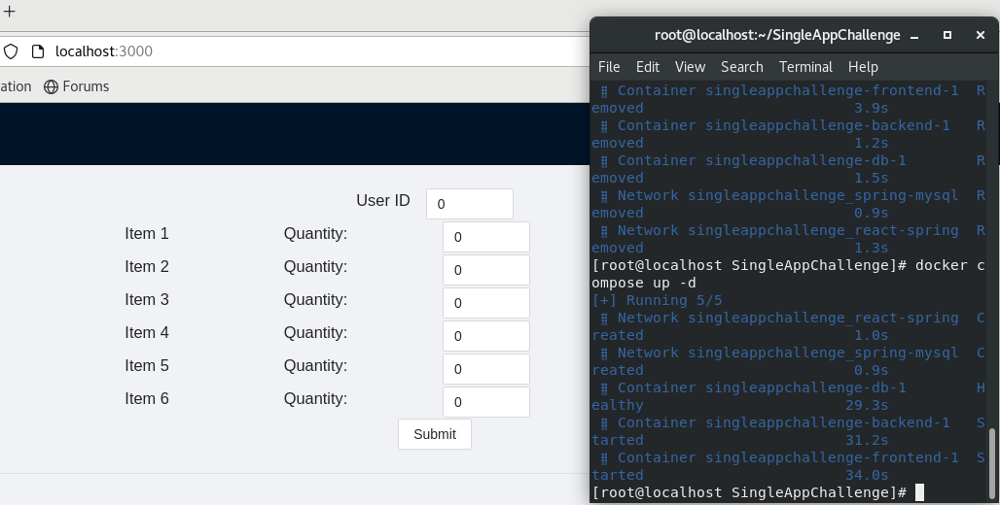
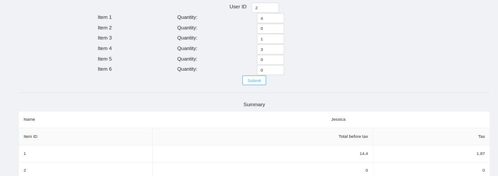

# SingleAppChallenge

The code here satisfies the requirement of coding-challenge.pdf.

Build and run the application by: 

```
docker compose up -d
```
Then visit <https://localhost:3000>

The instruction to install Docker is [here](https://docs.docker.com/get-docker).


Code could run successfully in CentOS 8 amd64.
Screenshots are here:







Information of customers and items can be modified by editing [data.sql](https://github.com/hzt323hzt/SingleAppChallenge/blob/main/SingleBack/src/main/resources/data.sql)


